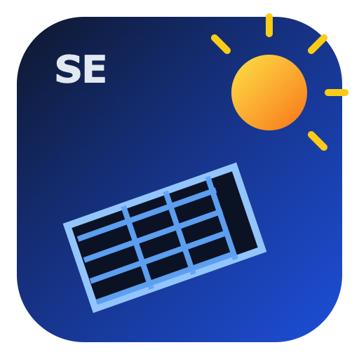

# ioBroker SolarEdge Modbus Adapter (Custom)



Dieser Adapter liest SolarEdge Modbus Register, rechnet Scale Factors um und legt die gewuenschten Datenpunkte in ioBroker an.

## Ziel-Datenpunkte

- Modbus_Status
- Batterie_Energie_max
- Batterie_Leistung
- Batterie_SOC
- Batterie_SOC_min
- Batterie_Time
- Batterie_Uhrzeit
- Batterie_Betriebsmodus (schreibbar)
- PV_Leistung
- PV_Energie_Gesamt
- PV_Energie_Tag
- Solaredge_Leistung
- Solaredge_Energie_Tag
- Grid_Leistung

## Verwendete Register (Default)

Die Defaults orientieren sich an SunSpec/SolarEdge Register-Layouts, wie sie in Open-Source-Implementierungen genutzt werden (u. a. `solaredge-modbus-multi`).

Hinweis: Register sind in der Admin-Seite komplett konfigurierbar.

| Zweck | Typ | Default Register |
|---|---|---:|
| Inverter AC Power | uint16 | 40084 |
| Inverter AC Power SF | int16 | 40085 |
| Inverter AC Energy Total | uint32 | 40094 |
| Inverter AC Energy SF | int16 | 40096 |
| Meter AC Power (Grid) | int16 | 40207 |
| Meter AC Power SF | int16 | 40211 |
| Battery DC Power | float32 (little-word) | 102837 |
| Battery Energy Max | float32 (little-word) | 102787 |
| Battery SOC | float32 (little-word) | 102853 |
| Battery Operating State / Storage Control Mode | uint16 | 103237 |

## Formeln

### SunSpec Scale Factor

Wenn ein Wert + SF existiert:

value = raw * 10^sf

### Konfigurierbare Formeln pro Datenpunkt

In der Admin-Seite gibt es einen eigenen Tab `Formulas`.
Jeder Ziel-Datenpunkt kann dort per Ausdruck ueberschrieben werden.

Verfuegbare Variablen (Auszug):

- inverterAcPower
- inverterEnergyWh
- gridPower
- batteryDcPower
- batteryEnergyMax
- batteryEnergyAvailable (berechnet aus batteryEnergyMax * max(0, batterySoc - batterySocMin) / 100)
- batterySoc
- batteryAcEfficiency

Bei ungueltiger Formel faellt der Adapter automatisch auf die Standardformel zurueck.

### Leistungswerte

- Solaredge_Leistung = Inverter_AC_Power (AC)
- Grid_Leistung = Meter_AC_Power (AC, optional invertierbar)
- Batterie_Leistung = Battery_DC_Power * batteryAcEfficiency (default 0.96), als AC-Schaetzung
- PV_Leistung = Solaredge_Leistung - Batterie_Leistung

### Energiewerte

- PV_Energie_Gesamt = Inverter_AC_Energy_Total (AC)
- Solaredge_Energie_Tag = lokal integrierte Tagesenergie aus Solaredge_Leistung
- PV_Energie_Tag = lokal integrierte Tagesenergie aus PV_Leistung
- Batterie_Energie_max = Battery_Energy_Max

### Batteriestatus

- Batterie_SOC = Battery_SOC
- Batterie_SOC_min = optional eigenes Register, sonst Tages-Minimum aus Batterie_SOC
- Batterie_Time:
  - bei Entladung (>0 W): Battery_Energy_Available / Batterie_Leistung
  - bei Ladung (<0 W): (Battery_Energy_Max - Battery_Energy_Available) / |Batterie_Leistung|
- Batterie_Uhrzeit:
  - bei Ladung (<0 W): Uhrzeit, wann 100% SOC erreicht wird
  - bei Entladung (>0 W): Uhrzeit, wann SOC_min erreicht wird

## Wichtige Hinweise

- Alle geforderten Leistungs-Datenpunkte werden als AC abgelegt.
- Batterie-Leistung ist ohne explizites AC-Batterieregister eine Naeherung aus DC-Leistung * Wirkungsgrad.
- Je nach Firmware/Geraet koennen Adress-Offsets variieren. Deshalb sind alle Register in Admin einstellbar.
- Register werden als absolute 40001-basierte Modbus-Adressen behandelt (Standard in vielen Dokus).
- Legacy-Eintraege mit zero-based Adressen werden automatisch nach absolut konvertiert (z. B. `15` -> `40016`) und einmalig als Warnung geloggt.
- Register werden gebuendelt (Batch-Reads) gelesen, um deutlich weniger Modbus-Requests zu erzeugen.

## Kommunikationstuning

Diese Parameter sind in den Adapter-Einstellungen verfuegbar:

- `modbusTimeoutMs` (Default `7000`)
- `maxReadLen` (Default `40`)
- `readIntervalMs` (Default `150`)
- `writeIntervalMs` (Default `100`)

Empfehlung bei Timeouts: `pollIntervalSec=3..5`, `modbusTimeoutMs=10000..15000`, `maxReadLen=30..60`, `readIntervalMs=100..250`.

## Troubleshooting: Leistungs- und Energiewerte sind leer

Wenn `Solaredge_Leistung`, `Solaredge_Energie_Tag`, `PV_Leistung` oder `PV_Energie_Tag` keinen Wert zeigen, prüfe:

### 1. Register-Adressen in ioBroker Admin korrekt?

In der Admin-Seite unter Tab `Registers` müssen die Inverter-Register genau so konfiguriert sein:
- Inverter AC Power: **40084** (uint16)
- Inverter AC Power SF: **40085** (int16)
- Inverter AC Energy WH: **40094** (uint32)
- Inverter AC Energy WH SF: **40096** (int16)

### 2. Adapter-Log prüfen

Starte den Adapter neu und schaue in den Logs nach:

**Zeile 1 - Konfigurierte Register (beim Start geloggt):**
```
Configured Modbus register plan: inverterAcPower=40084 (absolute 40084, offset 83), ...
```
Wenn hier andere Adressen stehen als oben aufgelistet, sind sie falsch in Admin konfiguriert.

**Zeile 2 - Diagnostik bei fehlenden Werten:**
```
Solaredge_Leistung unresolved: inverterAcPower register=..., ..., sf=...
```
- Wenn `sf` außerhalb von -10..10 liegt (z.B. `sf=5000`, `sf=8283`), liegt ein Register-Adress-Fehler vor.
- Wenn `sf` im gültigen Bereich ist aber `raw=-1`, existiert das Register am Wechselrichter nicht.

### 3. Adresse aktualisieren und Adapter neu starten

Falls Adressen falsch waren:
1. In Admin die korrekten Adressen setzen.
2. Speichern.
3. Adapter in ioBroker neu starten.
4. Log-Zeilen neu prüfen.

## Battery Operating Mode (Register 103237)

- Der Datenpunkt `Batterie_Betriebsmodus` ist les- und schreibbar.
- Register-Adresse: `registers.batteryOperatingState` (Default `103237`).
- Kodierung: `uint16`.
- Zulaessige Werte:
  - `0` Disabled (Speicherkontrolle deaktiviert)
  - `1` Maximize Self Consumption (Eigenverbrauch optimieren – Standard)
  - `2` Remote Control (Fernsteuerung)
  - `4` Remote Control (Alternativer Steuermodus)
- Bei `ack=false` schreibt der Adapter den Modus auf den Wechselrichter.

## Start

```bash
npm install
npm run check
```
